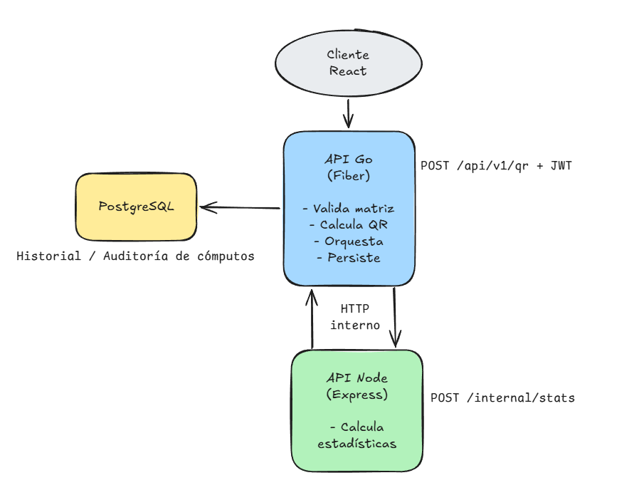

# Desafío Técnico — Factorización QR + Estadísticas

Dos APIs REST que colaboran vía HTTP, orquestadas con Docker Compose:

- **API en Go (Fiber):** recibe una matriz, calcula su **factorización QR**,
  pide estadísticas a la API de Node, persiste el resultado en PostgreSQL
  (auditoría) y devuelve todo compuesto.
- **API en Node (Express + TypeScript):** servicio de estadísticas genérico
  que calcula máximo, mínimo, promedio, suma y diagonalidad sobre las matrices.

> **Sobre el enunciado:** las secciones introductorias mencionan "rotación de
> matriz", pero la *Funcionalidad requerida* pide **factorización QR** (y la
> operación adicional habla de "las matrices", en plural = Q y R). Se implementa
> **QR**, tratando "rotación" como texto heredado. Decisión documentada.

## Arquitectura



Go actúa como **orquestador**: el cliente sólo necesita conocer la API de Go.
La comunicación Go→Node es HTTP y se protege mediante JWT HS256, usando un
secreto compartido entre ambos servicios.

## Cómo ejecutar (todo el stack)

Requiere Docker.

```bash
cp .env.example .env        # ajustar JWT_SECRET y credenciales
docker compose up --build
```

Servicios:
- Frontend → http://localhost:5173
- API Go → http://localhost:8080
- API Node → http://localhost:3000
- PostgreSQL → localhost:5432

Las migraciones de la base de datos se aplican automáticamente al arrancar la
API de Go (`AUTO_MIGRATE=true`).

### Flujo de ejemplo

```bash
# 1) Login → JWT
TOKEN=$(curl -s -X POST localhost:8080/auth/login \
  -H 'Content-Type: application/json' \
  -d '{"username":"demo","password":"demo123"}' | jq -r .token)

# 2) QR + estadísticas
curl -s -X POST localhost:8080/api/v1/qr \
  -H 'Content-Type: application/json' \
  -H "Authorization: Bearer $TOKEN" \
  -d '{"matrix":[[1,2],[3,4],[5,6]]}' | jq

# 3) Historial (auditoría)
curl -s localhost:8080/api/v1/computations \
  -H "Authorization: Bearer $TOKEN" | jq
```

## Endpoints

| Método | Ruta | API | Auth | Descripción |
|---|---|---|---|---|
| `POST` | `/auth/login` | Go | ❌ | Emite JWT |
| `POST` | `/api/v1/qr` | Go | ✅ | QR + estadísticas + persistencia |
| `GET`  | `/api/v1/computations` | Go | ✅ | Historial paginado |
| `GET`  | `/api/v1/computations/:id` | Go | ✅ | Cómputo por id |
| `POST` | `/internal/stats` | Node | ✅ | Estadísticas sobre matrices |
| `GET`  | `/health` | ambas | ❌ | Readiness |

## Decisiones técnicas destacadas

- **QR reducida** (Q m×n, R n×n): mantener R cuadrada hace válido el chequeo
  de diagonalidad. Requiere m ≥ n; una matriz ancha devuelve `422`.
- **Tests de QR por propiedades** (`A ≈ Q·R`, `QᵀQ ≈ I`, R triangular), no
  contra valores fijos, porque la QR no es única.
- **Diagonalidad con tolerancia** (`1e-9`): los ceros de una QR en coma flotante
  no son exactos.
- **Persistencia síncrona y obligatoria** en Go: integridad de auditoría
  (contexto de seguros).
- **Node genérico**: recibe matrices con nombre, no sabe de QR → reutilizable.
- **DI manual + interfaces** (cliente Node, repositorio) → testeable con mocks.

## Testing

```bash
# Go
cd go-api && go test ./...

# Node
cd node-api && npm install && npm test
```

## Integración continua

[.github/workflows/ci.yml](.github/workflows/ci.yml) corre en cada push a `main`
y en cada pull request, con tres jobs en paralelo:

- **Go API:** `go build`, `go vet`, `go test -race`.
- **Node API:** `npm ci`, `npm run build`, `npm test`.
- **Frontend:** `npm ci`, `npm run build`.

## Estructura del repositorio

```
.
├── go-api/            # API Go (Fiber) — ver go-api/README.md
├── node-api/          # API Node (Express + TS) — ver node-api/README.md
├── frontend/          # SPA React + TS (Vite) — ver frontend/README.md
├── docker-compose.yml # orquesta Frontend + Go + Node + PostgreSQL
├── .env.example
└── README.md
```

## Despliegue en la nube

Guía paso a paso para desplegar en **Railway** (4 servicios: frontend, go-api,
node-api y PostgreSQL) en [DEPLOY.md](DEPLOY.md). Los contenedores ya están
preparados para plataformas con puerto dinámico y red IPv6.
